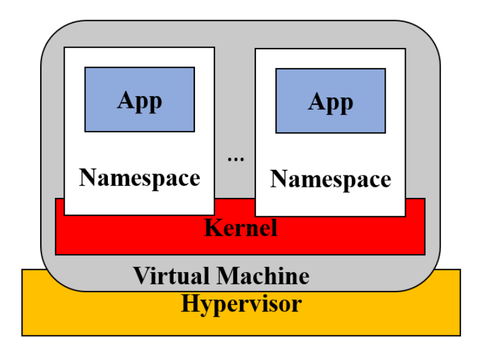

# Marco teórico 

## **Conceptos de inicializacion**

### Cluster:
Un cluster puede definirse como una arquitectura compuesta por múltiples nodos (servidores, máquinas virtuales o instancias computacionales) interconectados mediante una red de alta velocidad, coordinados para operar como una sola entidad. Este diseño busca maximizar la eficiencia del sistema a través de la distribución inteligente de cargas de trabajo, aprovechando la potencia combinada de sus recursos para aumentar el rendimiento, garantizar alta disponibilidad -mediante redundancia y replicación de servicios- y escalar horizontalmente la capacidad de procesamiento según las variaciones de la demanda.

*La clave está en la cooperación:*  si una computadora del grupo tiene problemas, las demás automáticamente toman su lugar para evitar interrupciones. Además, permiten agregar o quitar servidores fácilmente, lo que ayuda a adaptarse a momentos de alta o baja actividad sin desperdiciar recursos.

### Nodos:
En un clúster, las nodos están conectados para compartir sus recursos, como memoria, espacio de almacenamiento y capacidad de procesamiento. Esto permite repartir las tareas entre ellos de forma equilibrada, evitando que una solo se sobrecargue. La ventaja principal es que, si un nodo falla, los demás pueden encargarse de su trabajo al instante, manteniendo el servicio activo sin interrupciones.

### Maquinas virtuales:
Las máquinas virtuales funcionan mediante un software llamado hipervisor, que divide los recursos del hardware físico, como CPU, memoria y almacenamiento, entre varias VM de manera aislada. Este aislamiento asegura que cada VM opere de forma independiente, proporcionando flexibilidad para ejecutar diferentes sistemas operativos en un solo servidor físico.

### Contenedor

Un contenedor aísla un grupo de procesos del resto del sistema operativo, lo cual permite
que cada uno tenga una vista privada de elementos como el sistema de archivos, las
interfaces de red y otros recursos.
Las instancias de contenedor comparten el kernel. El sistema operativo con otros procesos del sistema y puede estar restringido hasta cierto punto para usar algunos recursos informáticos (CPU, RAM, etc).

### Ventajas de la contenedorizacion respecto al uso de maquinas virtuales

Los contenedores facilitan el despliegue rápido de aplicaciones entre diferentes arquitecturas en la nube, a diferencia de las máquinas virtuales (VMs). Operan sobre un mismo kernel, pero con un aislamiento de recursos comparable al de las VMs, ofreciendo menor sobrecarga administrativa y mayor eficiencia en tiempos de ejecución. Son más eficientes en el consumo de recursos en comparación con las VMs y permiten un inicio o detención en cuestión de segundos, brindando mayor agilidad. Además, garantizan la portabilidad y el despliegue en cualquier entorno sin conflictos de dependencias. Su adaptabilidad los hace ideales para entornos dinámicos con cargas de trabajo variables y escalabilidad bajo demanda, permitiendo una mayor movilidad en la nube.

### Limitaciones frente a las VMs
   * Poseen un menor aislamiento que las MVs, al estar menos aisladas no son tan seguras para aplicaciones críticas.
   * No reemplazan completamente a las VMs, ya que en escenarios dodne se requiera una aislacion total siguen siendo de utilidad    estas ultimas.  

Figura 1: Contenedores en la Nube

## **Modelo propuesto en la publicación *"Dynamic Scalability Model for Containerized Cloud Service"***

El usuario final envía una solicitud de ejecución de tarea a través de un balanceador de carga, cuyo rol es distribuir el tráfico de manera uniforme entre las Physical Machines (PM) disponibles en el sistema en la nube. Estas solicitudes, junto con los requisitos de ejecución de otros usuarios, se almacenan temporalmente en un búfer, que actúa como cola para la asignación de recursos virtuales. Una vez en la cola, las tareas se dirigen secuencialmente hacia una PM disponible, siguiendo un esquema de distribución equitativa.
&nbsp;

Cada solicitud se asigna a un contenedor único, garantizando aislamiento y dedicación de recursos. Ante picos de demanda, el sistema implementa un escalado vertical progresivo, agregando contenedores individuales según se requiera, lo que permite manejar cargas variables sin sobreaprovisionamiento.
&nbsp;

Para modelar el Cloud Data Center (CDC), se utiliza una red de colas abierta de Jackson (Figura 2), donde se asume que todas las PM son idénticas y operan bajo una política FIFO (First-In, First-Out).

En este modelo:

* Las solicitudes se tratan como unidades mínimas de procesamiento (tareas), ejecutables exclusivamente en contenedores.
* Al finalizar su servicio en la PM, las tareas abandonan el sistema sin retroalimentación.

Este enfoque asegura una gestión eficiente de recursos, priorizando la simplicidad en la distribución de cargas y la escalabilidad bajo demanda, mientras se mantiene un equilibrio entre rendimiento y consumo de recursos. La combinación de balanceo de carga, contenedores dinámicos y teoría de colas posiciona al sistema como una solución robusta para entornos en la nube con tráfico variable.

Figura 2: Modelo de colas para la nube de contenedores

En el esquema se pueden encontrar diferentes modelos como: **M/M/1, M/M/1/C y M/M/k/k**, las cuales son herramientas matemáticas empleadas en la teoría de colas para analizar el rendimiento y comportamiento de sistemas de espera, utilizando la notación de Kendall.
Cada componente de esta notación describe una característica específica del sistema.
Por ejemplo, un modelo M/M/k/k se interpreta de la siguiente manera:

 * M: Indica que las llegadas al sistema siguen un proceso de Poisson, lo que implica que ocurren de forma aleatoria e independiente  en el tiempo, con una tasa de llegada denotada por λ (lambda).
 * M: Representa que los tiempos de servicio también siguen un proceso de Poisson, con una tasa de servicio indicada por μ (mu).
 * k: Corresponde al número total de servidores disponibles en el sistema.
 * k: Define la capacidad máxima del sistema, es decir, la cantidad máxima de solicitudes que pueden estar presentes simultáneamente.

A continuación, se muestran las gráficas del paper. Analizaremos lo que se puede observar
en cada una de ellas.

