## Consideraciones

Para realizar las pruebas de carga se tuvieron en cuenta las siguientes consideraciones:

1. La tasa de servicio del servidor es 𝜇=10 como parametro de la distribucion exponencial. Definido en el archivo [server.py](./coding/implementacion_py.md/#servidor-de-respuestas-a-peticiones-http).
2. La tasa de arrivo 𝜆 se varia aumentando la carga en cada una de las pruebas.
3. La utilización del sistema 𝜌= 𝜆/𝜇 será el valor que se desea obtener en
las pruebas.
4. El tiempo de respuesta por solicitud T=1/(𝜇-𝜆), el cual se va a utilizar para comprar los valores teoricos y los obtenidos en la practica, para mas de un pod se calcula como T=1/(𝜇*k-𝜆).

### Tabla I: Resultados de las mediciones
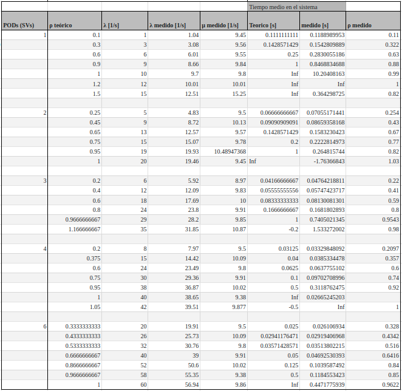

En la Tabla 1 se presentan los distintos escenarios diseñados para analizar el comportamiento del sistema. El ensayo consistió en realizar 28 pruebas distintas, en las cuales se modificaron diferentes parámetros con el objetivo de evaluar los resultados obtenidos en cada caso. Durante las pruebas, se varió la cantidad de pods en el clúster y, para cada configuración, se ajustaron los valores teóricos de λ (tasa de llegada de solicitudes) en función de la carga del sistema ρ que se deseaba analizar.

En la práctica, se observó el comportamiento real de los pods y se calculó el promedio de utilización de milicores en el clúster. Con este valor, se obtuvo el ρ práctico, lo que permitió determinar el μ práctico basándose en la ecuación del sistema para un modelo M/M/C, donde el número de servidores C corresponde a la cantidad de pods configurados en el clúster.

## Ecuaciones utilizadas para modelar el sistema

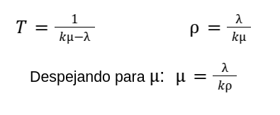

Donde *k* son la cantidad de PODS.
***

## **Tiempos de Respuesta del sistema en funcion de la tasa de arribo:**

Para valores bajo de carga del sistema ρ, el tiempo de respuesta es pequeño y estable, pero cuando se acerca a 1 o lo que es lo mismo cuando  λ se acerca demasiado a μ, el tiempo de respuesta crece rápidamente y el pod ya no puede manejar la carga de trabajo de manera efectiva lo que indica congestion y demoras altas.

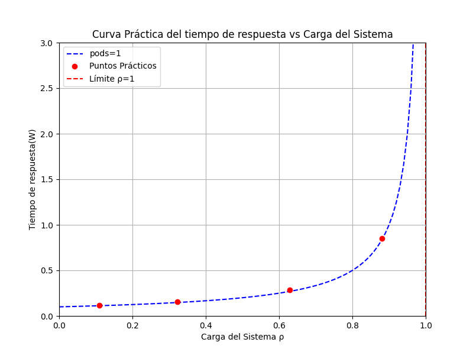

## **Numero de tareas en el sistema en funcion de la tasa de arribo:** 

Para valores bajos de λ, el numero esperado de tareas en el sistema crece de manera controlado, pero a medida que la tasa de arrivos se acerca a la capacidad del sistema (kμ), L se dispara, indicando sobrecarga y congestion. Cuando λ supera la capacidad del sistema, L tiende a infinito, y el sistema es inestable

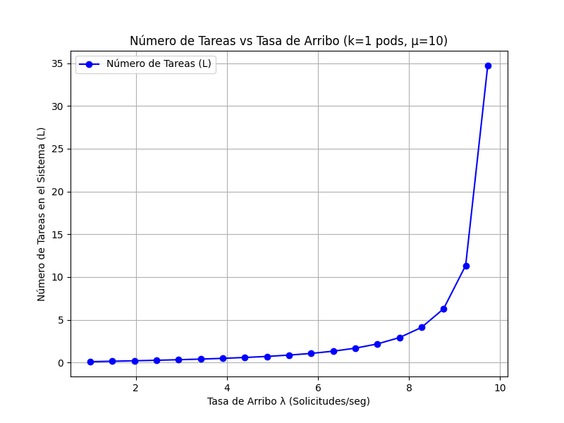

## **Consumo de CPU en el cluster en funcion de la tasa de arribo:**

El consumo de CPU en el cluster para los valores de lambda tomados crece en porcentaje a medida que se incrementa la tasa de arrivos, la utilidad en el sistema aumenta por lo tanto es mayor el consumo de recursos de hardware.

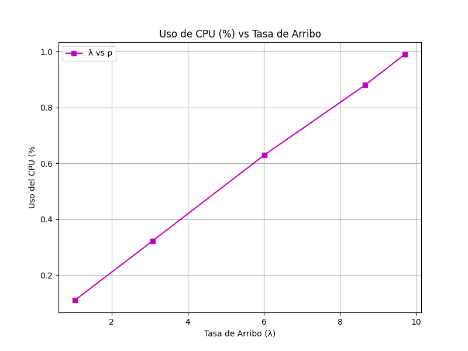

## Uso de CPU en la maquina anfitriona con el cluster corriendo en reposo y realizando una prueba de carga:

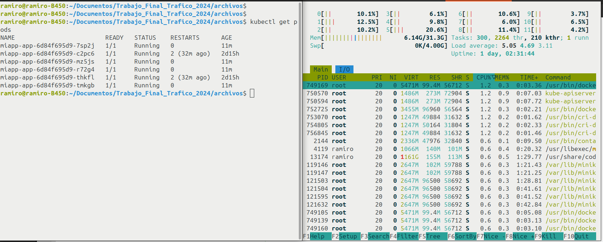

## **Tasa de perdida en funcion de la tasa de arribo:**

Al aumentar la tasa de arribo λ, el sistema tiende a saturarse, lo que provoca un aumento en el tiempo de respuesta, una mayor tasa de pérdida de solicitudes y una alta utilización de recursos.

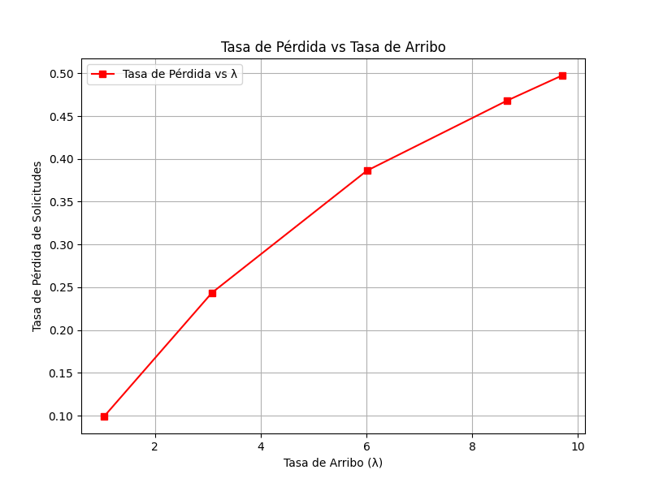

&nbsp;

## *Respuesta del sistema en funcion de la cantidad de servidores en ejecucion para un lambda=15 1/s y mu=10 1/s*

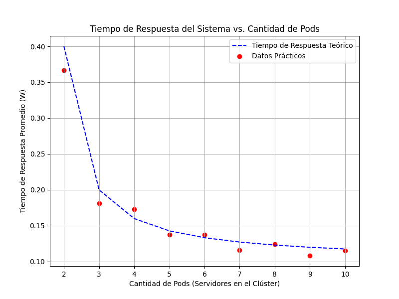

[*Scripts para graficar*](./coding/implementacion_py.md/#scripts-de-graficas).

&nbsp;

## **Tiempo de respuesta promedio en funcion del factor de utilidad para los valores medidos variando la cantidad de pods:**

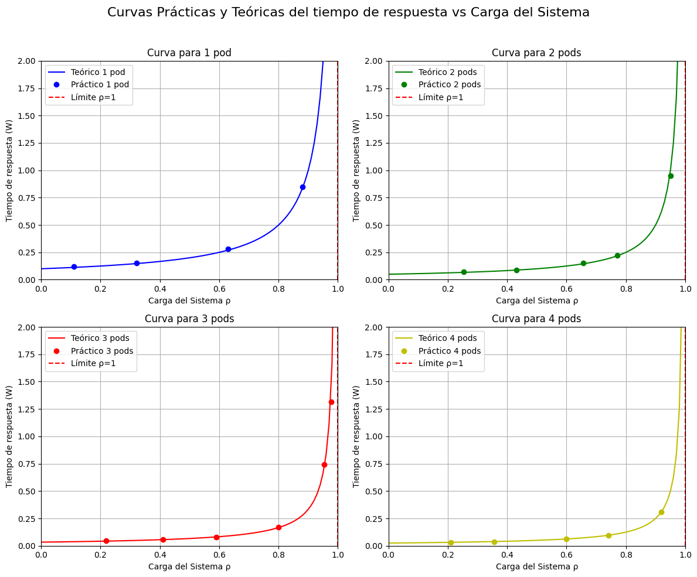

Se observa que a medida que se incrementan la cantidad de servidores disponibles, la curva de tiempo de respuesta en el sistema es menor.

## Uso del Horizontal Pod Autoescaler

### Caso 1: 1 Pod, λ=30
.png)

Configurando el HPA para que escale hasta un maximo de 6 pods cuando el uso promedio del CPU exceda el 25%, para este caso con una tasa de arribo igual a 30 1/s y para un pod en ejecucion el sistema se estabiliza aproximadamente a las 7000 solicitudes alcanzando el escalado maximo de 6 replicas.

### Caso 2: 2 Pod, λ=30

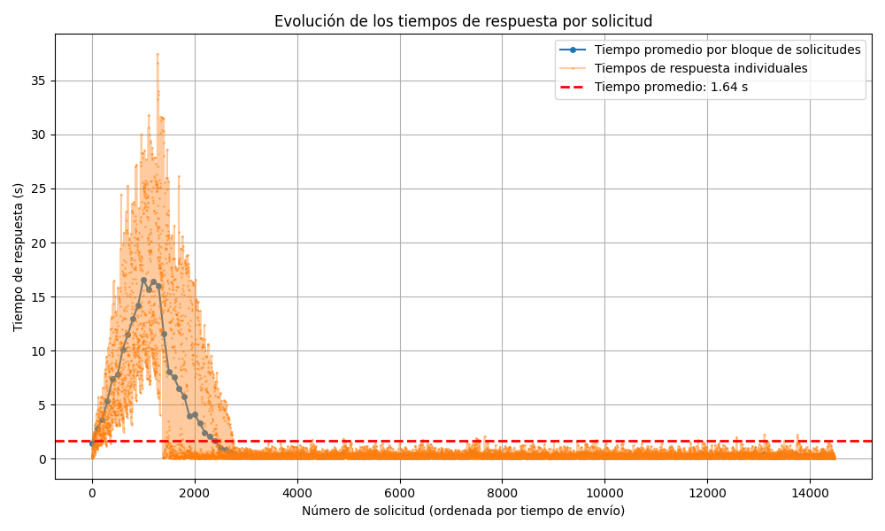

### Caso 3: 2 Pod, λ=40

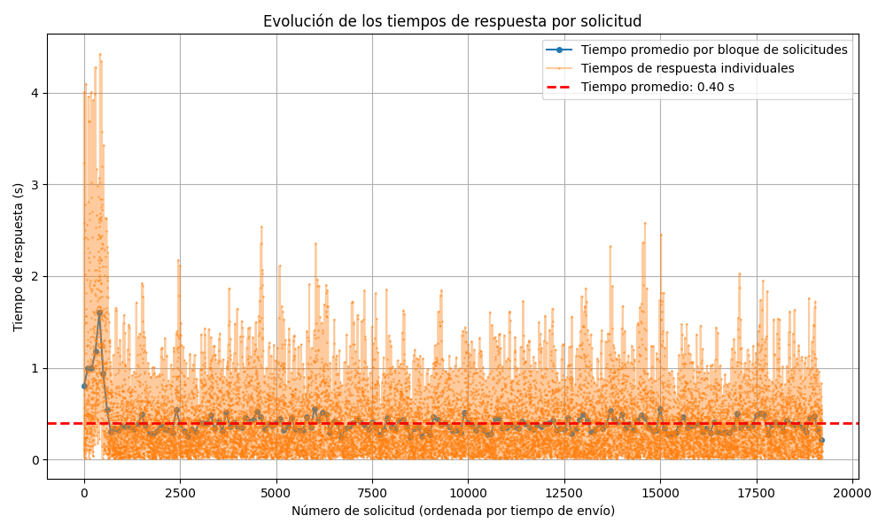

[*Horizontal Pod Autoescaler*](./coding/implementacion_yml.md/#horizontal-pod-autoescaler)
