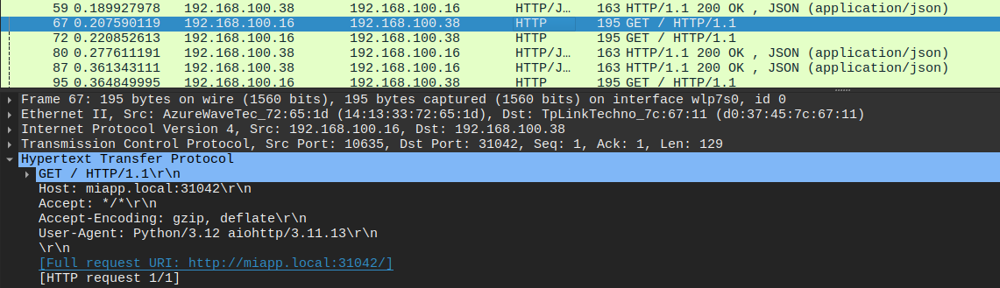
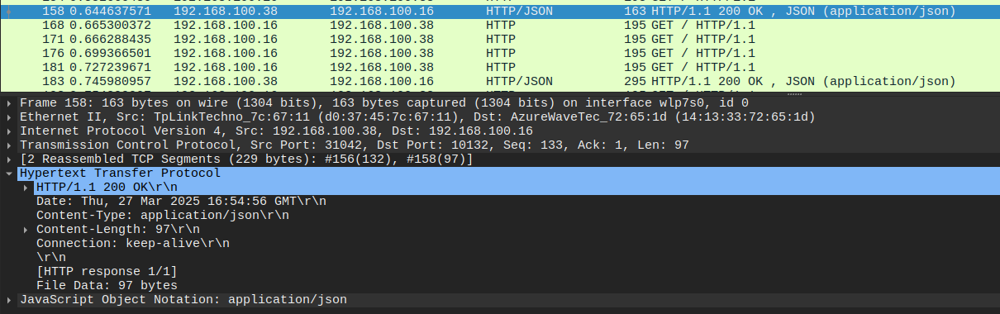

En la PC anfitrion donde se aloja el cluster, se tienen varios niveles que interactuan para dirigir el trafico interno y externo del cluster.
La *red interna y el POD Networking*, donde cada pod creado se le configura una IP privada definida por el plugin de red (por jemplo, 10.244.0.0/16). A estas IPs se puede acceder solamente desde dentro del cluster.
Los servicios de tipo ClusterIP generan una IP  virtual interna que permite que los pods se comuniquen entre sí y se distribuya la carga. Este Service no es accesible directamente desde el exterior.

En cuanto al recurso Ingress con el controlador NGINX, este se despliega en uno o varios pods y expone por los puertos 80 y 443 una entrada para el tráfico externo. Por medio de reglas basadas en host y path, el ingress redirige el tráfico a los Services correspondientes dentro del cluster.

Mientras que Minikube generalmente se ejecuta en una máquina virtual ( o en un contenedor, dependiendo del driver usado), tiene su propia red interna la cual conecta el cluster (nodos, pods, ingress, etc). Pero no se puede acceder directamente de manera externa a la red del cluster.

Para poder acceder externamente, se utilizo la  herramienta socat ejecutandose en la PC anfitriona para exponer el cluster al exterior.
Lo que socat hace es redirigir el tráfico que llega externamente al puerto de la PC anfitrion, y de allí lo envía al puerto de entrada del cluster que corresponde al del ingress en este caso. Permitiendo de este modo, por mas de que PODs y servicios tengan IPs internas, canalizar el trafico externo hacia el cluster y poder llegar a la API corriendo en los endpoints.
***

&nbsp;

Solicitud:

Se observan las IPs de origen y destino asi como tambien los puertos que forman parte entre el host cliente y la interfaz de red de la PC anfitrion. Luego, el socat se encarga de realizar el port forwarding mapeando el puerto 31042 de la PC host con el del ingress para tener acceso al cluster.

&nbsp;

Respuesta:

Después de que los pods procesan la solicitud y generan una respuesta, esta es
enviada de regreso al Ingress, que se encarga de transferirla desde la PC anfitrion hacia el cliente nuevamente con la información para almacenar en un archivo JSON.

